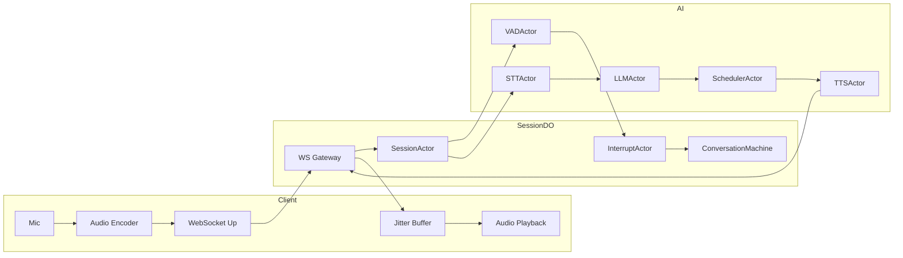

# High-Level Design (HLD)

## Server-Authoritative Duplex Voice Assistant (Thin Client Model)

---

## 0. Executive Summary

This system implements a **server-authoritative duplex voice assistant** where the **client is intentionally reduced to a minimal transport shell**.

All conversational intelligence, orchestration, and state management lives on the server.

Client responsibilities are strictly limited to:

* capture microphone audio
* stream audio upstream
* receive assistant audio
* play audio
* connect / mute

Nothing else.

Goal:

> Maximum simplicity at the edge client, maximum experimentation flexibility at the server.

---

## 1. Design Goals

* Sub-500 ms assistant speech start
* Ultra-thin reusable client SDK
* Server authoritative conversation logic
* Swappable AI providers
* Deterministic server orchestration
* Benchmark-friendly architecture
* Zero vendor lock-in
* Deployment neutrality

---

## 2. Architectural Philosophy

### 2.1 Dumb Client Principle

Client performs **no reasoning**.

Client does NOT:

* run VAD
* maintain conversation state
* interpret transcripts
* manage interruption logic
* synchronize machines

Client behaves as:

```
Microphone ⇄ WebSocket ⇄ Speaker
```

Why:

* universal embeddability
* SDK portability
* eliminates client divergence bugs
* simplifies debugging
* enables rapid benchmarking

---

## 3. System Layers

### Thin Client Layer

Responsibilities:

* Microphone capture
* Opus encoding (AudioWorklet)
* WebSocket connection
* Audio playback
* Mute toggle

No state machine exists on client.

Client reacts only to:

```
audio.frame
control.mute
```

---

### Edge Session Layer (Authoritative)

* WebSocket Gateway
* Durable Object Session Authority
* Server State Machine (XState)
* Actor Supervisor
* Interrupt Controller

All logic centralized here.

---

### AI Processing Layer

* Streaming STT Adapter
* Turn Detection Adapter
* Streaming LLM Adapter
* Sentence Scheduler
* Streaming TTS Adapter

---

## 4. Server Authoritative State Machine

Single authoritative machine exists:

```
ConversationMachine (Server)
```

Primary states:

```
IDLE
LISTENING
THINKING
SPEAKING
INTERRUPTING
RECOVERING
```

Client mirrors nothing.

Why:

* removes distributed sync complexity
* avoids split-brain states
* guarantees deterministic behavior

---

## 5. Actor Model (Server Only)

Each subsystem implemented as an XState actor.

| Actor               | Responsibility       |
| ------------------- | -------------------- |
| SessionActor        | session lifecycle    |
| UploadActor         | audio ingest         |
| VADActor            | turn detection       |
| STTActor            | transcription        |
| LLMActor            | reasoning            |
| SchedulerActor      | sentence emission    |
| TTSActor            | speech synthesis     |
| PlaybackStreamActor | downstream streaming |
| InterruptActor      | barge-in arbitration |

Actors supervised by SessionActor.

---

## 6. Wire Protocol (Minimal + Typed)

Transport remains WebSocket.

Protocol intentionally minimal.

### Client → Server

```
audio.chunk
control.mute
```

### Server → Client

```
audio.frame
```

---

### AudioChunk

```
{
  type: "audio.chunk",
  seq,
  timestamp,
  opus
}
```

### AudioFrame

```
{
  type: "audio.frame",
  seq,
  payload
}
```

No conversational events exposed externally.

Why:

* thin SDK
* future transport swap
* protocol stability

---

## 7. Durable Object Role

Durable Object acts as:

* session authority
* WebSocket owner
* actor runtime host
* event router

DO does NOT:

* embed provider logic
* store persistent history

Ensures portability outside Cloudflare.

---

## 8. Data Flow

1. Client streams audio continuously
2. SessionActor receives chunks
3. Audio duplicated into:

   * VADActor
   * STTActor
4. STT partials streamed into LLMActor
5. LLM tokens → SchedulerActor
6. Scheduler emits speakable units
7. TTSActor streams frames
8. PlaybackStreamActor sends frames immediately
9. Client plays continuously

---

## 9. Interruption Model

Server detects user speech during assistant playback.

Flow:

```
VAD detects speech
→ InterruptActor fires
→ cancel(LLMActor)
→ cancel(TTSActor)
→ fade downstream audio
→ transition LISTENING
```

Client unaware of interruption semantics.

---

## 10. Mermaid Architecture Diagram



---

## 11. Benchmark Instrumentation

Server emits metrics internally:

* VAD trigger latency
* STT first token
* LLM first token
* TTS first frame
* Speech start latency

Allows provider swapping without client change.

---

## 12. Deployment Neutrality

Transport abstraction allows deployment on:

* Cloudflare Workers
* Node.js
* Fly.io
* Kubernetes
* Local runtime

Client unchanged.

---

## 13. MVP Constraints (Strict)

* Single WebSocket per session
* One Durable Object per conversation
* No distributed coordination
* In-memory actor routing
* Stateless provider adapters

---

## 14. Explicit Non-Goals

* Client intelligence
* Distributed state sync
* Peer-to-peer media
* Persistent memory
* Multi-region migration

---

## 15. Key Decisions and Why

| Decision          | Why                   |
| ----------------- | --------------------- |
| Dumb client       | universal SDK         |
| Server authority  | deterministic control |
| Actors on server  | safe concurrency      |
| Minimal protocol  | portability           |
| Streaming only    | latency target        |
| Provider adapters | benchmarking          |

---

## 16. Evolution Path

Phase 1: Workers AI MVP Phase 2: Provider benchmarking Phase 3: Self-hosted inference Phase 4: Multi-agent routing
