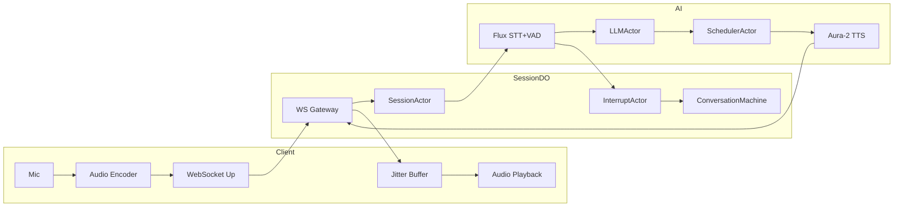

# High-Level Design (HLD)

## Server-Authoritative Duplex Voice Assistant (Thin Client Model)

---

## 0. Executive Summary

This system implements a **server-authoritative duplex voice assistant** where the **client is intentionally reduced to a minimal transport shell**.

All conversational intelligence, orchestration, and state management lives on the server.

Client responsibilities are strictly limited to:

* capture microphone audio
* stream audio upstream
* receive assistant audio
* play audio
* connect / mute

Nothing else.

Goal:

> Maximum simplicity at the edge client, maximum experimentation flexibility at the server.

---

## 1. Design Goals

* Sub-500 ms assistant speech start
* Ultra-thin reusable client SDK
* Server authoritative conversation logic
* Swappable AI providers
* Deterministic server orchestration
* Benchmark-friendly architecture
* Zero vendor lock-in
* Deployment neutrality

---

## 2. Architectural Philosophy

### 2.1 Dumb Client Principle

Client performs **no reasoning**.

Client does NOT:

* run VAD (server uses Flux turn detection)
* maintain conversation state
* interpret transcripts
* manage interruption logic
* synchronize machines

Client behaves as:

```
Microphone ⇄ WebSocket ⇄ Speaker
```

Why:

* universal embeddability
* SDK portability
* eliminates client divergence bugs
* simplifies debugging
* enables rapid benchmarking

---

## 3. System Layers

### Thin Client Layer

Responsibilities:

* Microphone capture (AudioWorklet, 16 kHz, linear16 PCM)
* Send audio to server: Flux path uses ~8.2 KB chunks (256 ms) for STT; keep-alive when idle
* WebSocket connection(s) as needed (e.g. session WS + optional direct Flux WS)
* Audio playback (TTS stream from server)
* Mute / connect only

No state machine on client. Client reacts only to:

```
audio.frame
control.mute
```

---

### Edge Session Layer (Authoritative)

* WebSocket Gateway
* Durable Object Session Authority
* Server lifecycle state machine (XState): `connected` | `streaming` | `closed`; turn pipeline (LLM → TTS) runs in the DO with interrupt support.
* Interrupt handling via `control.interrupt` and in-pipeline abort flag.

All logic centralized here.

---

### AI Processing Layer (Workers AI Stack)

| Concern   | Provider | Model / API |
| --------- | -------- | ----------- |
| **STT + VAD** | Workers AI | **@cf/deepgram/flux** — streaming speech recognition with built-in turn detection (StartOfTurn, EagerEndOfTurn, TurnResumed, EndOfTurn). No separate VAD. |
| **LLM**       | Workers AI | Fastest available chat model for streaming reasoning. |
| **TTS**       | Workers AI | **@cf/deepgram/aura-2-en** — context-aware TTS (natural pacing, expressiveness); streaming or batch; output e.g. MPEG. |

* Flux adapter: receives client PCM or server-side audio feed; emits transcript + turn events.
* LLM adapter: streams tokens; supports cancellation for barge-in.
* Sentence scheduler: emits speakable units from LLM stream.
* TTS adapter (Aura-2): text → audio stream; cancellation on interrupt.

---

## 4. Server Authoritative State Machine

**Current implementation:** A single XState machine in the DO models session lifecycle only:

* **connected** — initial; accepts binary (audio) and JSON (control, transcript_final).
* **streaming** — receiving binary; ring buffer + echo engine feed.
* **closed** — WebSocket close/error; entry runs cleanup (flush echo, null refs).

The turn pipeline (transcript_final → LLM stream → sentence buffer → TTS) runs in the DO outside the machine; one active turn at a time with an abort flag for `control.interrupt`. Future evolution may model “processing” as a machine state or sub-actor.

Client mirrors nothing.

Why:

* removes distributed sync complexity
* avoids split-brain states
* guarantees deterministic behavior

---

## 5. Logical Roles (Server)

* **Session lifecycle** — XState machine (connected / streaming / closed); cleanup on close.
* **Audio ingest** — Ring buffer + echo engine (binary path).
* **Flux (STT + turn detection)** — Client connects to `/v2/flux/:id`; Flux provides transcript and turn boundaries (no separate VAD).
* **Turn pipeline** — transcript_final → LLM adapter (Workers AI) → sentence buffer → TTS adapter (Aura-2); one turn at a time; abort on `control.interrupt`.
* **Barge-in** — Client sends `control.interrupt`; server sets abort flag; pipeline exits and clears streaming state.

---

## 6. Wire Protocol (Minimal + Typed)

Transport remains WebSocket. See `src/vani2/protocol.ts` for types.

### Client → Server

* **Binary** — audio chunk (opaque).
* **JSON** — `control.mute` (boolean), `control.interrupt`, `transcript_final` (text).

### Server → Client

* **Binary** — audio frame (e.g. MPEG from TTS).
* **JSON** — `state` (connected | streaming | closed), `error` (reason), `llm_partial` / `llm_complete` / `llm_error`, and optional `benchmark.*` events for metrics.

---

### AudioChunk

```
{
  type: "audio.chunk",
  seq,
  timestamp,
  opus
}
```

### AudioFrame

```
{
  type: "audio.frame",
  seq,
  payload
}
```

No conversational events exposed externally.

Why:

* thin SDK
* future transport swap
* protocol stability

---

## 7. Durable Object Role

Durable Object acts as:

* session authority
* WebSocket owner
* actor runtime host
* event router

DO does NOT:

* embed provider logic
* store persistent history

Ensures portability outside Cloudflare.

---

## 8. Data Flow

1. Client streams audio (linear16, 16 kHz, ~8.2 KB chunks) to session / Flux
2. **Flux** (STT + VAD): produces transcript + turn events (StartOfTurn, Update, EagerEndOfTurn, TurnResumed, EndOfTurn)
3. Turn-final or chosen transcript events → **LLMActor** (Workers AI)
4. LLM token stream → SchedulerActor → speakable units
5. **TTSActor** (Aura-2) turns text → audio (e.g. MPEG stream)
6. PlaybackStreamActor sends audio frames to client
7. Client plays continuously

No separate VAD pipeline; Flux supplies turn boundaries.

---

## 9. Interruption Model

Server detects user speech during assistant playback via **Flux** (e.g. StartOfTurn or TurnResumed during playback).

Flow:

```
Flux turn event (e.g. StartOfTurn) during playback
→ InterruptActor fires
→ cancel(LLMActor)
→ cancel(TTSActor)
→ fade downstream audio
→ transition LISTENING
```

Client unaware of interruption semantics.

---

## 10. Mermaid Architecture Diagram



---

## 11. Benchmark Instrumentation

Server emits metrics internally:

* Flux: first event latency, turn boundary latency
* STT (Flux) first token / partial
* LLM first token
* TTS (Aura-2) first frame
* Speech start latency (end-to-end)

Allows provider swapping without client change.

---

## 12. Deployment Neutrality

Transport abstraction allows deployment on:

* Cloudflare Workers
* Node.js
* Fly.io
* Kubernetes
* Local runtime

Client unchanged.

---

## 13. MVP Constraints (Strict)

* Single WebSocket per session
* One Durable Object per conversation
* No distributed coordination
* In-memory actor routing
* Stateless provider adapters

---

## 14. Explicit Non-Goals

* Client intelligence
* Distributed state sync
* Peer-to-peer media
* Persistent memory
* Multi-region migration

---

## 15. Key Decisions and Why

| Decision          | Why                   |
| ----------------- | --------------------- |
| Dumb client       | universal SDK         |
| Server authority  | deterministic control |
| Actors on server  | safe concurrency      |
| Minimal protocol  | portability           |
| Streaming only    | latency target        |
| Provider adapters | benchmarking          |

---

## 16. Provider Stack (Workers AI)

| Layer   | Model / API | Notes |
| ------- | ----------- | ----- |
| STT+VAD | **@cf/deepgram/flux** | Streaming; turn events native; linear16 16 kHz. |
| LLM     | Workers AI (fastest chat) | Streaming tokens; cancellation for barge-in. |
| TTS     | **@cf/deepgram/aura-2-en** | Context-aware; natural pacing/expressiveness; text → audio (e.g. MPEG). |

---

## 17. Evolution Path

Phase 1: Transport + echo. Phase 2: Flux STT+VAD (transcription-first). Phase 3: Workers AI LLM. Phase 4: Aura-2 TTS + barge-in. Phase 5: Scale and observability. Later: provider benchmarking, self-hosted inference, multi-agent routing.
